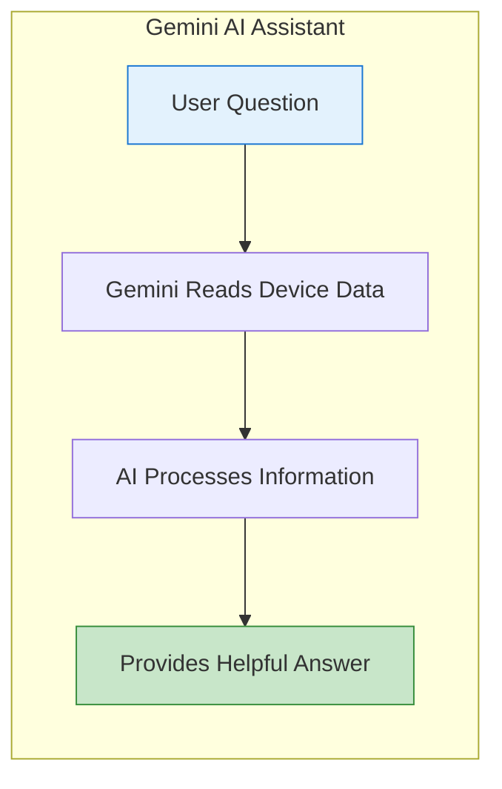

# AI Security Achievement: Driving Framework Adoption Through Superior Attack Discovery

## The Problem: No Buy-In from Major Teams

**"We don't need an AI governance framework - individual patches are sufficient"**
- Engineering teams see framework as unnecessary overhead
- Product teams prioritize speed over security standards  
- No unified approach across divisions
- Each team believes their AI implementation is secure enough

---

## Background: How Samsung's AI Integration Works

### Slide 1: What is Gemini?



**Simple Explanation:** Gemini is like a smart assistant that can read information from your phone (calendar, emails, etc.) and help you with tasks.

### Slide 2: Samsung's Cross-App Feature

```mermaid
graph TB
    subgraph "Your Samsung Phone"
        Calendar[📅 Calendar]
        Email[📧 Email]
        Browser[🌐 Browser]
        IoT[🏠 Smart Home]
        
        Gemini[🤖 Gemini AI]
        
        Calendar -->|Can Read| Gemini
        Email -->|Can Read| Gemini
        Gemini -->|Can Open| Browser
        Gemini -->|Can Control| IoT
    end
    
    User[👤 You: "What's on my schedule?"] --> Gemini
    
    style Gemini fill:#fff3cd,stroke:#856404,stroke-width:3px
```

**Simple Explanation:** Samsung allows Gemini to connect different apps together - it can read your calendar and then take actions like opening websites or controlling smart devices.

---

## Our Discovery: A Game-Changing Attack

### Previous Attack vs. Our Superior Attack

```mermaid
graph TB
    subgraph "Old Attack - Limited Impact"
        OA[Hacker sends bad calendar invite] --> OB[You ask about your day]
        OB --> OC[You must type 'thanks' ⚠️]
        OC --> OD[Opens smart home window]
        style OC fill:#ffcccc,stroke:#cc0000
    end
    
    subgraph "Our Attack - Serious Threat"
        NA[Hacker sends hidden message in calendar] --> NB[You ask about your day]
        NB --> NC[🚨 Automatically steals your data!]
        NC --> ND[Sends private info to hacker]
        style NC fill:#ff6666,stroke:#cc0000,stroke-width:3px
        style ND fill:#ff6666,stroke:#cc0000,stroke-width:3px
    end
```



### Why Our Attack is Superior

| Aspect | Previous Attack | Our Attack |
|--------|----------------|------------|
| **User Action Needed** | Yes - must say "thanks" | **No - fully automatic** |
| **What it Does** | Opens a window | **Steals your private data** |
| **Detection** | Easily spotted | **Hidden using special encoding** |
| **Impact** | Annoying | **Serious privacy breach** |

---

## The Impact: Changed Everything

### Immediate Reactions

```mermaid
graph LR
    Discovery[Our Attack Demo] --> EVP1[EVP Mobile Security:<br/>"This changes everything"]
    Discovery --> EVP2[EVP Product Innovation:<br/>"We need that framework NOW"]
    
    EVP1 --> Framework[✅ AI Governance Framework Approved]
    EVP2 --> Framework
    
    style Discovery fill:#ffd43b,stroke:#fab005,stroke-width:3px
    style Framework fill:#51cf66,stroke:#2f9e44,stroke-width:3px
```

### Driving Framework Adoption

**Before Our Discovery:**
- "We don't need a framework"
- "Our team's AI is secure"
- "Too much overhead"

**After Our Discovery:**
- **Mobile Team**: "We need this framework immediately"
- **IoT Team**: "Our AI integrations need review"  
- **Product Team**: "Security must be built-in from start"

### Positive Feedback Received

> "This attack demonstration was the wake-up call we needed. It clearly shows why patching individual AI agents isn't enough - we need a comprehensive framework." - EVP Mobile Security

> "The team's work has accelerated our AI security initiative by at least 6 months." - EVP Product Innovation

---

## Key Takeaway

**Our superior attack discovery proved that AI security isn't just about fixing individual problems - it's about having a comprehensive framework to prevent them.**

The ability to automatically steal data without any user interaction beyond a simple question transformed the conversation from "do we need this?" to "how fast can we implement it?"
