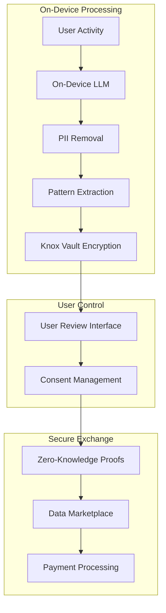
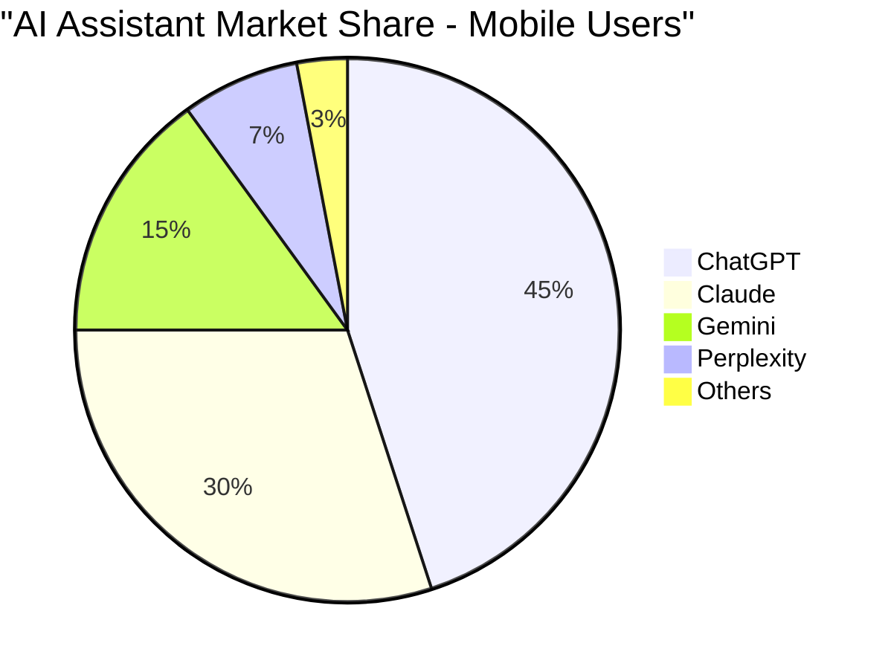
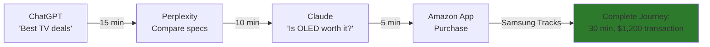
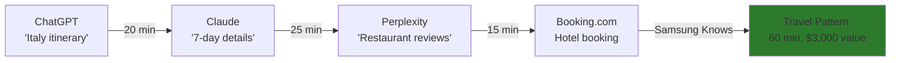
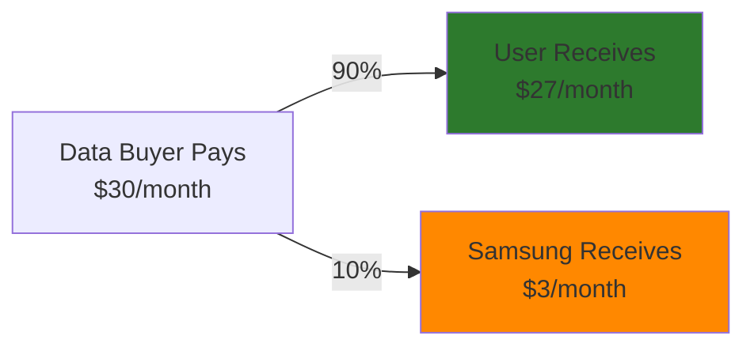

# Samsung Personal Data Engine - Executive Pitch Deck

## Your Data. Your Money. Your Choice.
### Powered by On-Device AI That Protects Your Privacy

---

## Slide 1: Title Slide

# **Samsung Personal Data Engine**

**Your Data. Your Money. Your Choice.**

*Revolutionizing data ownership in the multi-agent AI era through on-device AI and hardware-secured privacy*

---

## Slide 2: The Opportunity

### **Transform Every Samsung Device Into a Privacy-Preserving Revenue Generator**

- **Market Reality:** Data monetization is a $464B+ market dominated by tech giants
- **User Reality:** Users generate valuable data but receive zero compensation
- **Technology Shift:** The multi-agent AI era creates unprecedented data value
- **Samsung's Position:** Unique hardware + software integration enables a new model

---

## Slide 3: The Problem

## **Current Data Economy: Extraction Without Compensation**

| Company | Annual Ad Revenue (2023) | User Compensation | Privacy Model |
|---------|-------------------------|-------------------|---------------|
| Google | ~$282B | $0 | Centralized collection |
| Meta | ~$135B | $0 | Cross-platform tracking |
| Amazon | ~$47B | $0 | Purchase behavior analysis |

**Core Issues:**
- Users have no control over their data
- Privacy is sacrificed for free services
- No transparency in data usage
- Zero economic participation for users

---

## Slide 4: The Solution

## **Samsung Personal Data Engine**
*The World's First Privacy-Preserving Data Marketplace*

### Core Components:
1. **Knox Vault Hardware Security** - Data encrypted at chip level
2. **On-Device AI Processing** - PII removal before any sharing
3. **User Consent Framework** - Granular control over data sharing
4. **Transparent Revenue Sharing** - 90% to users, 10% to Samsung
5. **Cryptographic Verification** - Auditable, tamper-proof records

### Value Proposition:
> "Turn every Samsung phone into a personal data asset that generates revenue while protecting privacy"

---

## Slide 5: Unique Samsung Advantage

## **The OS-Level Intelligence Only Samsung Can Capture**

### What AI Companies See vs. What Samsung Sees:

```mermaid
graph TD
    subgraph "What Expedia's AI Sees"
        A1[Travel Assistant Opens]
        A2[User Books Flight]
        A3[App Closes]
        A1 --> A2 --> A3
    end
    
    subgraph "What ChatGPT Sees"
        B1[ChatGPT Opens]
        B2[User Asks Question]
        B3[ChatGPT Closes]
        B1 --> B2 --> B3
    end
    
    subgraph "What ONLY Samsung Sees"
        C1[9:00 AM - ChatGPT: 'Plan 5-day Tokyo trip']
        C2[9:15 AM - Perplexity: 'Best hotels in Shibuya']
        C3[9:30 AM - Expedia: Browse flights]
        C4[9:45 AM - Claude: 'Write vacation request email']
        C5[10:00 AM - Google Maps: Save Tokyo locations]
        C6[10:15 AM - Amazon: Order travel accessories]
        
        C1 --> C2 --> C3 --> C4 --> C5 --> C6
        
        style C1 fill:#ff6b6b
        style C2 fill:#45b7d1
        style C3 fill:#f7b731
        style C4 fill:#4ecdc4
        style C5 fill:#ea4335
        style C6 fill:#ff9900
    end
```



### The Unique Value of OS-Level Intelligence:

| Data Type | App Level | OS Level (Samsung) | Value to AI Companies |
|-----------|-----------|-------------------|---------------------|
| **Purchase Intent** | ❌ Can't see | ✅ Full journey | Know when research becomes buying |
| **Decision Timeline** | ❌ No data | ✅ Complete path | Understand consideration period |
| **Competitor Usage** | ❌ Invisible | ✅ Clear patterns | See where users go next |
| **Task Completion** | ❌ Fragmented | ✅ End-to-end | Track actual outcomes |

### Example Intelligence:
**"Samsung data reveals that 67% of users who ask ChatGPT for product recommendations switch to Claude for detailed comparisons before buying"**
- ChatGPT doesn't know they lost the sale
- Claude doesn't know they closed it
- **Only Samsung can sell this intelligence**

---

## Slide 6: Technical Architecture

## **Hardware-Secured, AI-Enhanced Privacy**

### Security Stack:


### Key Technical Features:
- **Knox Vault TEE** for hardware-level security
- **On-device summarization LLM** for privacy preservation
- **Differential privacy** implementation
- **Cryptographic audit trails**

---

## Slide 7: How It Works

## **Three Simple Steps**

### For Users:
1. **Use Your Phone Normally** - No behavior change required
2. **Review & Approve** - See exactly what data is shared (with PII removed)
3. **Get Paid Monthly** - Direct deposits to your account

### For Data Buyers:
1. **Access Aggregated Intelligence** - Cross-agent patterns and behaviors
2. **Receive Verified Data** - Cryptographically authenticated
3. **Pay for Value** - Direct marketplace pricing

---

## Slide 8: Privacy-First Design

## **On-Device AI Protection**

### What We Actually Sell (Privacy-Preserved Examples):

#### ✅ **Data We Share (After PII Removal):**

**AI Usage Patterns:**
```json
{
  "user_segment": "power_user_travel",
  "ai_usage": {
    "chatgpt": "45% - trip planning",
    "claude": "30% - detailed reviews",
    "perplexity": "25% - price research"
  },
  "journey_time": "avg_47_minutes",
  "conversion_rate": "23%"
}
```

**Cross-Platform Behaviors:**
- "User researches for 20+ minutes before purchases over $500"
- "82% probability of using Claude after ChatGPT for complex tasks"
- "Peak AI usage Tuesday mornings, 9-11 AM"
- "Switches to Perplexity for fact-checking in 31% of sessions"

#### ❌ **Data We Never Share:**
- Actual travel destinations or dates
- Specific product names or purchases
- Personal conversations content
- User identity or demographics
- Exact location or IP address
- Account information or credentials

### User Control Interface Example:
```
┌─────────────────────────────────────────┐
│ This Month's Data Summary               │
├─────────────────────────────────────────┤
│ Value Generated: $24.50                 │
│ Your Earnings: $22.05 (90%)            │
│                                         │
│ What You're Sharing:                   │
│ • AI app usage patterns (anonymized)   │
│ • General task categories              │
│ • Time-of-day preferences              │
│ • App switching sequences              │
│                                         │
│ Privacy Status: ✅ Fully Protected      │
│ PII Removed: ✅ 100%                   │
│                                         │
│ [Review Details] [Approve] [Modify]     │
└─────────────────────────────────────────┘
```

---

## Slide 9: Business Model

## **Revenue Projections**

### Conservative Model Assumptions:
- **Data value per user:** $10-30/month (based on current ad revenue per user)
- **Revenue share:** 90% to users, 10% to Samsung
- **Samsung revenue per user:** $1-3/month

### Scaling Projections:

| Phase | Users | Samsung Monthly Revenue | Annual Revenue |
|-------|-------|------------------------|----------------|
| Pilot (Y1) | 100K | $100K-300K | $1.2M-3.6M |
| Launch (Y2) | 10M | $10M-30M | $120M-360M |
| Growth (Y3) | 50M | $50M-150M | $600M-1.8B |
| Scale (Y5) | 200M | $200M-600M | $2.4B-7.2B |

### Additional Revenue Streams:
- Premium device sales with enhanced privacy features
- Enterprise API licenses
- Aggregated market intelligence products

---

## Slide 10: Multi-Agent AI Intelligence

## **The Data Gold Mine: Complete AI Usage Patterns**

### Aggregate AI Usage Intelligence (Example):



### Real Consumer Journey Examples:

#### 🛍️ **Black Friday Shopping Journey**


#### ✈️ **Vacation Planning Pattern**


### Intelligence Value for AI Companies:

| AI Company | What They Learn | Business Impact |
|------------|-----------------|-----------------|
| **ChatGPT** | "45% market share but users leave for detailed analysis" | Product depth opportunity |
| **Claude** | "Closes 40% of purchases ChatGPT initiates" | Partnership potential |
| **Perplexity** | "Strong for research, weak for decisions" | Expansion opportunity |
| **Gemini** | "15% share, mainly Android integration" | Growth strategy insights |

### Key Patterns We Can Sell:
- **Task Migration:** Which AI users choose for different stages
- **Time Investment:** Average session length by task type
- **Conversion Paths:** From research to transaction
- **Competitive Switching:** When and why users change AI assistants

> "Every AI company is guessing. Samsung knows."

---

## Slide 11: Data Value Proposition

## **Why AI Companies Will Pay Premium Prices**

### Current Market Reality:
- **Cost to acquire a user:** $50-200 per user
- **Cost of market research:** $100K+ for limited surveys
- **Competitive intelligence:** Often impossible to obtain
- **Samsung's offering:** Real-time, verified behavioral data

### Example Data Products & Value:

#### **For AI Companies - Competitive Intelligence Package**
```
Monthly Insights Report:
- Your market share vs competitors
- User retention metrics
- Task completion rates
- Switching patterns to/from your platform
- Peak usage times and contexts

Price: $20-50 per user per month
```

#### **For E-commerce - Purchase Intent Signals**
```
Real-time Alerts:
- Users researching products in your category
- Comparison shopping patterns
- Price sensitivity indicators
- Cart abandonment predictors

Price: $10-30 per qualified lead
```

#### **For Market Research - Behavioral Analytics**
```
Aggregated Trends:
- AI adoption patterns by use case
- Task migration between platforms
- Emerging use cases
- Technology adoption curves

Price: $100K-500K per industry report
```

### Revenue Share Example:


---

## Slide 12: Go-to-Market Strategy

## **Phased Rollout Plan**

### Phase 1: Foundation (Months 1-6)
- Technical infrastructure development
- Privacy framework implementation
- Pilot program in select market
- Initial AI company partnerships

### Phase 2: Launch (Months 7-12)
- Public launch in key markets
- Onboard major AI platforms
- User education campaign
- Privacy certification

### Phase 3: Scale (Year 2+)
- Global expansion
- Full AI ecosystem integration
- Enterprise offerings
- Advanced analytics products

---

## Slide 13: Competitive Positioning

## **Samsung's Unique Position**

| Capability | Samsung | Apple | Google | Meta |
|-----------|---------|-------|--------|------|
| Hardware control | ✅ | ✅ | ❌ | ❌ |
| Open ecosystem | ✅ | ❌ | ✅ | ✅ |
| OS-level access | ✅ | ✅ | ✅ | ❌ |
| Privacy hardware | ✅ | ✅ | ❌ | ❌ |
| Multi-platform data | ✅ | ❌ | ✅ | ✅ |
| **User revenue sharing** | **✅** | **❌** | **❌** | **❌** |

---

## Slide 14: Investment Requirements

## **Resources Needed**

### Development Phase:
- **Budget:** $30-50M initial investment
- **Team:** 80-100 engineers (AI, security, distributed systems)
- **Timeline:** 12-18 months to market

### Key Milestones:
- Q1: Technical architecture finalized
- Q2: On-device AI integration complete
- Q3: Pilot program launch
- Q4: Commercial launch preparation

### Expected Returns:
- Break-even: 18-24 months
- Target IRR: 40%+
- Strategic value: Premium positioning for all Samsung devices

---

## Slide 15: Risk Mitigation

## **Addressing Key Concerns**

### Privacy & Regulatory:
- **Risk:** Data protection regulations
- **Mitigation:** On-device processing, user consent, privacy-by-design

### Market Adoption:
- **Risk:** User education required
- **Mitigation:** Simple UX, clear value proposition, gradual rollout

### Technical Complexity:
- **Risk:** Scalability challenges
- **Mitigation:** Proven Samsung infrastructure, phased deployment

### Competitive Response:
- **Risk:** Platform retaliation
- **Mitigation:** Hardware moat, first-mover advantage, user lock-in

---

## Slide 16: The Vision

## **Pioneering the Future of Data Ownership**

### Near-term Impact:
- First company to pay users for their data
- Industry-leading privacy protection
- New revenue stream for Samsung

### Long-term Transformation:
- Redefine the data economy
- Set new privacy standards
- Create sustainable user value model

> **"Samsung doesn't just protect your data. We make it work for you."**

### Call to Action:
**Let's build the world's first user-centric data marketplace together.**

---

## Appendix: Technical Specifications

### On-Device AI Requirements:
- NPU utilization: <10% average
- Battery impact: <2% daily
- Storage: ~500MB for models
- Processing: Real-time capability

### Security Architecture:
- Hardware: Knox Vault TEE
- Encryption: AES-256 hardware-backed
- Privacy: Differential privacy (ε = 1.0)
- Verification: Zero-knowledge proofs

### Data Categories Protected:
- Personal identifiers (PII)
- Location information
- Specific content/queries
- Financial information
- Health data

---

*Note: All financial projections are estimates based on market analysis and should be validated through pilot programs and user research.*
