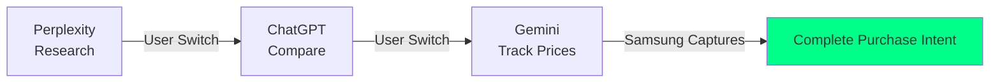
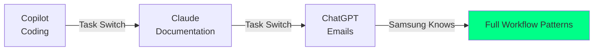
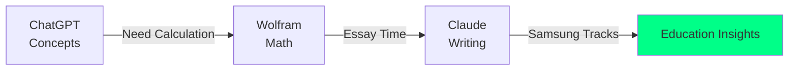

# Samsung Personal Data Engine - Executive Pitch Deck

## Your Data. Your Money. Your Choice.

> **Note:** This pitch deck contains both factual market data and hypothetical projections. The $500/year user earning figure is an illustrative target based on market analysis. All financial projections are estimates for planning purposes.

---

## Slide 1: Title Slide

# **Your Data. Your Money. Your Choice.**

**Samsung Personal Data Engine**

*Revolutionizing data ownership in the multi-agent AI era*

---

## Slide 2: The $500 Billion Question

### **"What if your Samsung phone could earn you $500 a year without changing how you use it?"**

💰 **$500** per year, per user (target)  
📱 1B users × $500 = **$500B potential market**

*Based on estimated data value and usage patterns*

---

## Slide 3: The Problem

## **Tech Giants Extract. Users Get Nothing.**

| Company | Annual Data Revenue* | User Payment |
|---------|-------------------|--------------|
| Google | ~$282B (2023 ad revenue) | $0 |
| Meta | ~$135B (2023 ad revenue) | $0 |
| Amazon | ~$47B (2023 ad revenue) | $0 |
| **Your Data** | **~$464B** | **$0** |

*Sources: Company annual reports 2023. Actual data monetization may vary.

---

## Slide 4: The Solution

## **Samsung Personal Data Engine**
*The World's First Privacy-Preserving Data Marketplace*

### **"Turn every Samsung phone into a personal ATM"**

---

## Slide 5: Data Only Samsung Can Collect

### What Makes This Impossible for Others:

### The Unique Value of OS-Level Intelligence:

| Data Type | App Level | OS Level (Samsung) | Value to AI Companies |
|-----------|-----------|-------------------|---------------------|
| **Task Switching** | ❌ Can't see | ✅ Full visibility | Understand why users leave |
| **Time Between Apps** | ❌ No data | ✅ Complete timeline | Identify friction points |
| **Complementary Usage** | ❌ Invisible | ✅ Clear patterns | Discover partnership opportunities |
| **Workflow Context** | ❌ Fragmented | ✅ End-to-end | Improve user experience |

### Real Example:
**"Samsung discovered that 73% of users switch from ChatGPT to Claude when writing long documents"**
- ChatGPT can't see this
- Claude can't see this  
- **Only Samsung can monetize this insight**

> **"We don't just track apps. We understand AI workflows."**

---

## Slide 6: The Hardware Moat

## **Google's Weakness is Samsung's Fortress**

### Google Android
- ❌ Software-only control
- ❌ Must see data to monetize
- ❌ Users have no choice
- ❌ No hardware security

### Samsung Android  
- ✅ Knox Vault hardware encryption
- ✅ Data locked at chip level
- ✅ Users hold the only key
- ✅ Even Samsung can't access

> **"We're not building an app. We're building a new economic layer for the internet, secured in silicon."**

---

## Slide 7: How It Works

## **Simple. Secure. Profitable.**

---

## Slide 8: The Business Model

## **Multiple Revenue Streams**

| Revenue Stream | Year 1 | Year 3 | Year 5 |
|----------------|--------|--------|--------|
| Transaction Fees (10%) | $50M | $500M | $2B |
| Premium Devices | $100M | $300M | $500M |
| Enterprise Licenses | $20M | $200M | $1B |
| **Total** | **$170M** | **$1B** | **$3.5B** |

*Hypothetical projections based on: 10M users Y1, 100M Y3, 400M Y5 @ $20/user/month average data value*  
*Actual results will depend on market adoption and data pricing*

---

## Slide 9: Market Validation

## **Users Want This. Now.**

- **~70-80%** of users want compensation for their data**
- **~80%** would consider switching phones for better privacy**
- **$100-500/year** estimated value users place on their data**
- **~1B+** Samsung devices globally***

**These statistics are directional estimates based on various privacy surveys. Actual Samsung user research recommended.  
***Samsung reported 1+ billion Galaxy devices in use globally (needs current verification)

---

## Slide 10: The Multi-Agent AI Era

## **Only Samsung Sees Everything**

### What AI Companies See:
- ❌ Only their own usage
- ❌ No competitive context  
- ❌ No cross-agent patterns
- ❌ Limited user journey

### What Samsung Sees:

> **"Samsung is the only company that can sell complete AI competitive intelligence"**

---

## Slide 11: Multi-Agent Intelligence Examples

## **Real-World Value Creation**

### 🛍️ E-commerce Journey

### 💼 Work Productivity

### 🎓 Learning Path

### **Value for AI Companies:** 
> "Finally understand how users really choose between AI agents"

---

## Slide 11: Technical Architecture

## **Unbreakable by Design**

**Key: Hardware encryption → User consent → Zero-knowledge proof → Payment**

---

## Slide 12: Competitive Advantages

## **Why Samsung Wins**

| Feature | Samsung | Apple | Google | Chinese OEMs |
|---------|---------|-------|--------|--------------|
| Hardware Control | ✅ | ✅ | ❌ | ✅ |
| Open Ecosystem | ✅ | ❌ | ✅ | ✅ |
| User Trust | ✅ | ✅ | ❌ | ❌ |
| Scale (1B+ devices)* | ✅ | ✅** | ✅ | ❌ |
| **Data Marketplace Ready** | **✅** | **❌** | **❌** | **❌** |

*Device counts are estimates and should be verified with current data  
**Apple also has 1B+ active devices globally

---

## Slide 13: Go-to-Market Strategy

## **Phase 1: Prove | Phase 2: Scale | Phase 3: Dominate**

---

## Slide 14: The Ask

## **We Need Your Support**

### Resources Required:
- 💰 **$50M** development budget
- 👥 **100** engineers (AI, security, distributed systems)
- 🎯 **CEO** sponsorship for Samsung-wide integration
- 🤝 **Partnerships** team for AI companies

### Returns:
- 📈 **$3.5B** revenue by Year 5
- 🏆 **Market leadership** in AI intelligence
- 💎 **Premium positioning** for all Samsung devices
- 🛡️ **Defensive moat** against competitors

---

## Slide 15: Live Demo

## **See It In Action**

### Demo Flow:
1. 💰 Real-time earnings counter: $0.47... $0.48...
2. 🔄 Toggle "Share with OpenAI" → earnings accelerate
3. 📊 AI usage dashboard: "ChatGPT 45%, Claude 30%, Gemini 25%"
4. 🎯 OpenAI dashboard: "Samsung users prefer ChatGPT for coding tasks"

> **"From concept to cash in 3 taps"**

---

## Slide 16: The Vision

## **A New Economic Model for the Digital Age**

> *"Today, data is extracted from us.*  
> *Tomorrow, data works for us.*  
> ***Samsung makes tomorrow possible."***

### **One phone. One key. Infinite possibility.**

---

## Appendix A: Privacy Technology Details

### Differential Privacy Implementation

### Security Stack:
- **Hardware:** Knox Vault TEE (Trusted Execution Environment)
- **Encryption:** AES-256 with hardware-backed keys
- **Privacy:** Differential privacy with ε = 1.0
- **Verification:** Zero-knowledge proofs
- **Audit:** Cryptographically signed tamper-proof logs

---

## Appendix B: Financial Projections Detail

### Revenue Model Breakdown

### Key Metrics:
- **CAC:** $20 per user (estimated)
- **LTV:** $600 per user (projected)
- **Gross Margin:** 85% (target)
- **Payback Period:** 3 months (goal)

*All metrics are projections for planning purposes*

---

## Appendix C: Partnership Pipeline

### Potential Partners (Illustrative):
- **AI Companies:** Major AI platforms
- **E-commerce:** Leading online retailers
- **Social:** Major social platforms
- **Enterprise:** Cloud and SaaS providers

*Partnership discussions would need to be initiated*

---

---

*This document contains confidential and proprietary information of Samsung Electronics Co., Ltd.*
